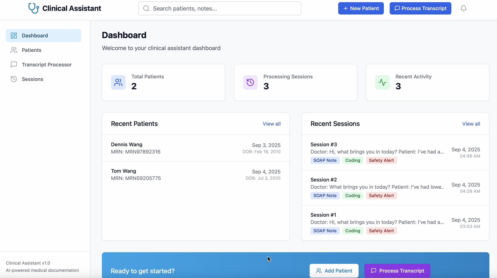

# Mini Clinical Assistant

A streamlined AI-powered clinical transcript processor built with Node.js, React, TypeScript, and SQLite. Transform consultation transcripts into structured SOAP notes and coding suggestions with session history tracking.

## Demo

### Video Demo
[](./demo.mov)

### Key Features Shown
- Upload/paste medical transcripts
- AI-generated SOAP notes (Subjective, Objective, Assessment, Plan)
- Medical coding suggestions (ICD-10, CPT codes)
- Copy individual sections or export full JSON
- Session history with persistent storage

## Setup

### Prerequisites
- Node.js 18+
- OpenAI API Key

### Installation & Configuration

1. **Install dependencies:**
   ```bash
   # Backend
   cd backend && npm install
   
   # Frontend
   cd ../frontend && npm install
   ```

2. **Configure OpenAI API Key:**
   ```bash
   cd backend
   cp .env.example .env
   # Edit .env and add: OPENAI_API_KEY=your_key_here
   ```

## Running the Application

**Start both services:**
```bash
# Backend (Terminal 1)
cd backend && npm run dev

# Frontend (Terminal 2)  
cd frontend && npm run dev
```

**Concurrently:**
```bash
npm run dev # starts both services
```

**Access:**
- App: http://localhost:5173
- API: http://localhost:3001

## Design Choices

### Architecture
**Streamlined Full-Stack App** - Focused on core transcript processing with minimal features:
- **Dashboard**: Patient & session overview
- **Patients**: Basic patient management  
- **Transcript Processor**: Core AI-powered transcript → SOAP + coding
- **Sessions**: Processing history with persistence

### Technology Stack
**Backend**: Node.js + Fastify + SQLite
- Fastify for high-performance API
- SQLite for simplicity (no database setup required)
- Direct OpenAI API integration for transcript processing

**Frontend**: React + TypeScript + Tailwind
- Modern React with full type safety
- Tailwind for rapid, consistent styling
- Vite for fast development experience

### AI Processing Pipeline
**Single-Purpose Focus** - Transform medical transcripts into structured documentation:

1. **Input**: Upload .txt files or paste transcripts directly
2. **AI Processing**: OpenAI generates structured SOAP notes + coding suggestions
3. **Safety Guardrails**: Emergency detection, compliance warnings, cautious language
4. **Output**: Formatted sections with copy buttons + full JSON export
5. **Persistence**: Auto-save all sessions with page refresh recovery

### Data Persistence
**Session-Centric Storage**:
- All transcript processing automatically saved as "sessions"
- Dual-layer persistence: localStorage + database
- Page refresh maintains current work
- Complete session history with searchable results

### User Experience
**Medical Professional Focused**:
- Compliance banners requiring clinical review acknowledgment
- Copy buttons for each section (Subjective, Objective, Assessment, Plan)
- Export entire results as JSON for record keeping
- Safety alerts for high-risk content with required acknowledgment
- Clean, professional UI suitable for clinical environments

### Time Spent

~6.5 Hours (with vibe coding)